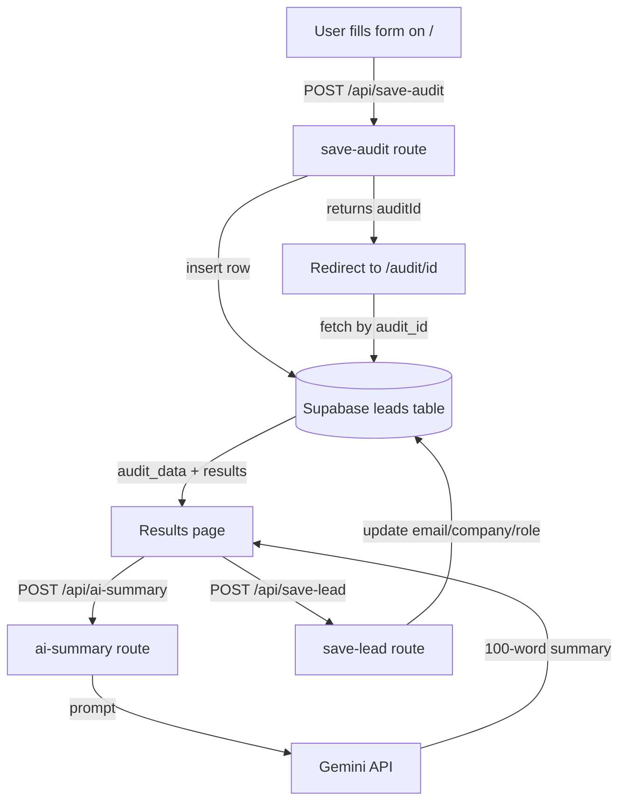

# Architecture

## What I built
SpendLens is a free AI spend audit tool for startup founders and engineering managers. Users input their AI tool subscriptions and instantly see where they're overspending, with specific recommendations and savings figures.

## System diagram

## Data flow
1. User fills the spend form → form state saved to localStorage on every keystroke
2. On submit: audit engine runs locally in the browser (pure TypeScript, no API call)
3. Results + audit ID sent to `/api/save-audit` → inserted into Supabase
4. User redirected to `/audit/[id]` → page fetches audit from Supabase by ID
5. User clicks "Generate summary" → `/api/ai-summary` calls Gemini API
6. User submits email → `/api/save-lead` updates the Supabase row

## Why this stack
- **Next.js**: Single framework for frontend + API routes. No separate backend needed.
- **TypeScript**: Catches type errors in audit logic at compile time, not runtime.
- **Supabase**: Instant Postgres database with a REST API. No backend setup needed.
- **Tailwind CSS**: Fast styling without writing CSS files.
- **Gemini API**: Free tier sufficient for this scale. Easy fallback if it fails.
- **Vercel**: Zero-config deploy that connects directly to GitHub.

## What I'd change for 10k audits/day
- Add Redis caching for audit results (avoid repeated Supabase reads for shared URLs)
- Move Gemini summary generation to a background job queue (don't block page load)
- Add a CDN layer (Cloudflare) in front of Vercel for static assets
- Add database indexes on `audit_id` and `created_at` columns
- Rate limit the `/api/save-audit` endpoint (currently unbounded)
- Split audit engine into a separate microservice if logic grows complex